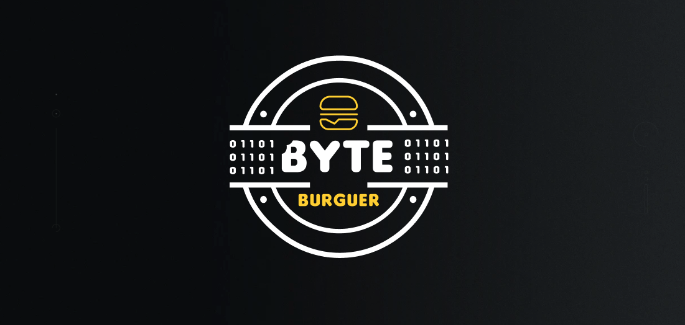

<!-- Permite  a funcionalidade de voltar ao topo -->

<!-- Titulo do projeto -->

    

<!-- Breve descrição sobre o projeto -->

  <h4>O Iburguer é um sistema projetado para gerenciar os pedidos da lanchonete fictícia Byte Burguer, como parte do desafio tecnológico de Arquitetura de Software do curso de Pós-Graduação em Tecnologia da FIAP, Turma 4SOAT. Construído por <a href="https://github.com/CarlosEduAC">Carlos Cardoso</a>, <a href="https://github.com/LuanPCunha">Luan Cunha</a>, <a href="https://github.com/matheusantonio">Matheus Cardoso</a> e <a href="https://github.com/vinisaeta">Vinicius Saeta</a>.
  </h4>

# Índice

- [🆘 O Problema](#Problema)
- [📝 Sobre o Sistema IBurguer](#Sobre)
- [💡 Iburguer Onboarding](#onboarding)
- [🔎 Testes](#Teste)
- [💻 Vídeo](#Videos)
- [📕 Licença](#Licenca)

# 🆘 O Problema 

A lanchonete Byte Burguer está experimentando um grande sucesso e está buscando expandir seu negócio. No entanto, sem um sistema eficaz de controle de pedidos, o atendimento aos clientes pode se tornar caótico e desorganizado. Por exemplo, considere um cenário em que um cliente faz um pedido personalizado, como um hambúrguer com ingredientes específicos, acompanhado de batatas fritas e uma bebida. O pedido pode ser registrado em um papel e enviado à cozinha, mas não há garantia de que será preparado corretamente.

A ausência de um sistema de controle de pedidos pode resultar em falta de comunicação entre os atendentes e a cozinha, ocasionando atrasos na preparação e entrega dos pedidos. Isso pode levar a erros na execução dos pedidos, como perdas, interpretações equivocadas ou esquecimentos, o que resulta na insatisfação dos clientes e na perda de negócios.

Em suma, um sistema de controle de pedidos é essencial para garantir que a lanchonete possa atender seus clientes de maneira eficiente, gerenciando seus pedidos e estoques de forma adequada. Sem essa ferramenta, a expansão da lanchonete pode não ser bem-sucedida, prejudicando a satisfação do cliente e impactando negativamente nos negócios.

# 📝 Sobre o Sistema IBurguer

A lanchonete planeja introduzir um sistema de autoatendimento de fast food, composto por uma variedade de dispositivos e interfaces, incluindo um totem e um aplicativo intuitivo. Isso permitirá aos clientes fazerem pedidos sem a necessidade de interação com um atendente, personalizando suas escolhas entre várias opções de lanches, acompanhamentos, bebidas e sobremesas.

O objetivo é viabilizar à lanchonete Byte Burguer uma solução operacional completa, com funcionalidades como gerenciamento de pedidos, sistemas de autoatendimento, cadastro e identificação de clientes, além de um cardápio digital. Essas características visam aprimorar a eficiência operacional, oferecer uma experiência melhor para os clientes e criar oportunidades de crescimento para o negócio.

# 💡 Iburguer-onboarding

Este repositório é dedicado ao projeto Iburguer-Api. O Iburguer-onboarding tem como responsabilidade ....

🎮 Tecnologias

---

Esse projeto foi feito utilizando as seguintes tecnologias:

- [C#](https://learn.microsoft.com/pt-br/dotnet/csharp/)

📦 Build & Tests

---

| CI/CD | Status |
| --- | --- | 
| Build & Unit Tests | 

# 🔎 Testes
- [Testes](docs/Teste.md)

# 💻 Vídeos

### Fase 2
* O detalhamento da **arquitetura** está disponibilizados no seguinte [vídeo](https://www.youtube.com/watch?v=QVkNK2sfK38).

### Fase 3
* O detalhamento da **infraestrutura** está disponibilizados no seguinte [vídeo]().   

# 📕 Licença

Lançado em 2023

Construído por [Carlos Cardoso](https://github.com/CarlosEduAC), [Luan Cunha](https://github.com/LuanPCunha), [Matheus Cardoso](https://github.com/matheusantonio) e [Vinicius Saeta](https://github.com/vinisaeta) 🚀.
Esse projeto esta sobre [MIT license](./LICENSE).

[De volta ao topo](#topo)

